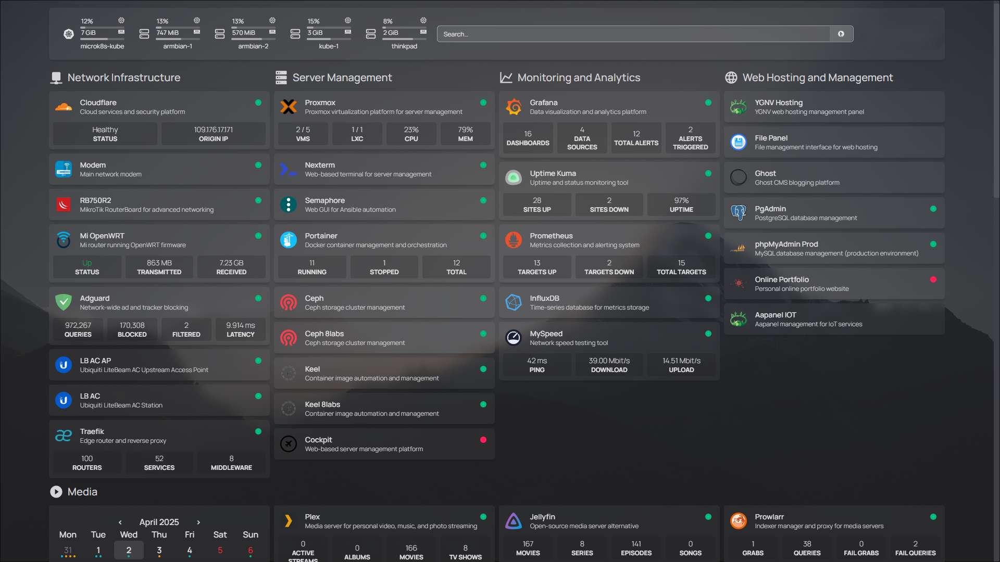
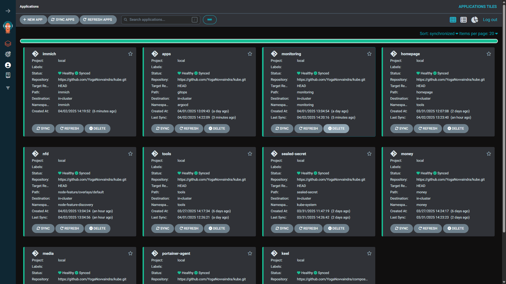
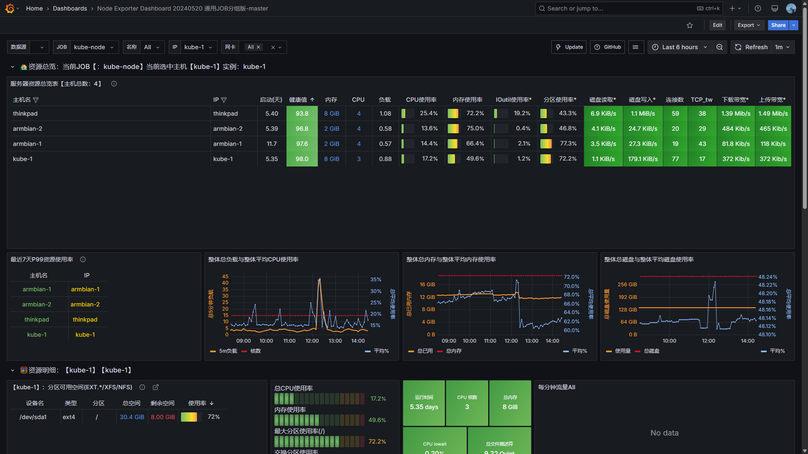

# 🏡 HomeLab Kubernetes Cluster

Welcome to my HomeLab Kubernetes Cluster! This repository contains the configuration and deployment files for managing various services and applications in my homelab environment. The cluster is designed to provide a self-hosted, automated, and scalable infrastructure for personal and experimental use.

## 📋 Table of Contents

- [Screenshots](#-screenshots)
- [Overview](#-overview)
- [Statistics](#-statistics)
- [Features](#-features)
- [Prerequisites](#-prerequisites)
- [Quick Start](#-quick-start)
- [Repository Structure](#-repository-structure)
- [Applications](#-applications)
  - [Core Infrastructure & GitOps](#-core-infrastructure--gitops)
  - [General Tools & Utilities](#️-general-tools--utilities)
  - [Observability & Monitoring](#-observability--monitoring)
  - [Application Services](#-application-services)
  - [Media](#-media)
- [Infrastructure](#-infrastructure)
- [Deployment Workflow](#-deployment-workflow)
- [Security Implementation](#-security-implementation)
- [Troubleshooting](#-troubleshooting)
- [Contributing & Adaptation](#-contributing--adaptation)
- [License](#-license)

## 📸 Screenshots

### 🏠 Homepage


### 🚀 ArgoCD


### 📊 Grafana


## 📊 Statistics

- **Total Applications**: 50+ services across 12+ namespaces
- **Storage Solutions**: CephFS (distributed) + RustFS (S3-compatible)
- **Monitoring Stack**: Full observability with 12+ exporters and Prometheus/Grafana
- **Security Tools**: Sealed Secrets, Trivy, Authentik SSO, Network Policies
- **Automation**: GitOps with ArgoCD, Keel for auto-updates, Renovate for dependency management

## 🌟 Overview

The Kubernetes cluster follows **declarative infrastructure management** principles, where all configurations are version-controlled and automatically synchronized with the cluster state. Key organizational components include:

- **📁 Namespace Segregation**: Services are grouped by purpose, often residing in dedicated namespaces named after the application or service group (e.g., `harbor`, `monitoring`).
- **⚙ GitOps Workflow**: ArgoCD-driven continuous deployment from Git repository
- **🔐 Security First**: Sealed Secrets for encrypted credential management
- **🤖 Automated Updates**: Keel for container images and Renovate for dependency versions

## 🚀 Features

- **📜 Declarative Configuration**: Entire infrastructure defined as code in version-controlled manifests
- **🔄 GitOps Automation**: ArgoCD synchronization with self-healing capabilities
- **🆕 Continuous Updates**: 
  - `Keel`: Automatic rolling updates for latest container images
  - `Renovate`: Semantic versioning maintenance for container images
- **📊 Observability Stack**: Prometheus/Grafana monitoring with alert integration
- **🗄 Persistent Storage**: CephFS provisioner with automated volume management, plus RustFS for S3-compatible object storage
- **🔒 Zero-Trust Security**: Authentik SSO integration and network policies
- **📡 Load Balancing**: MetalLB for bare-metal load balancing

## 📋 Prerequisites

Before deploying this infrastructure, ensure you have:

- **Kubernetes Cluster**: MicroK8s or compatible Kubernetes distribution (v1.24+)
- **Storage**: CephFS provisioner configured or alternative storage class
- **Network**: 
  - MetalLB configured for LoadBalancer services (bare-metal)
  - DNS configured for ingress domains
  - Optional: Cloudflare tunnel for external access
- **Git Repository**: Access to this repository for ArgoCD
- **Sealed Secrets**: Sealed Secrets controller installed and configured
- **Container Registry**: Access to container images (Harbor or public registries)
- **Hardware**: 
  - Sufficient resources for 50+ applications
  - GPU support for media transcoding (optional)
  - Network-attached storage for persistent volumes

## 🚀 Quick Start

1. **Bootstrap ArgoCD**:
   ```bash
   kubectl apply -f argocd/
   ```

2. **Deploy App-of-Apps**:
   ```bash
   kubectl apply -f apps.yml
   ```

3. **Access ArgoCD UI**:
   - Port-forward: `kubectl port-forward svc/argocd-server -n argocd 8080:443`
   - Get admin password: `kubectl -n argocd get secret argocd-initial-admin-secret -o jsonpath="{.data.password}" | base64 -d`

4. **Monitor Deployments**:
   - ArgoCD will automatically sync applications from the `gitops/` directory
   - Check status in ArgoCD UI or via CLI: `argocd app list`

5. **Configure Sealed Secrets**:
   - Install Sealed Secrets controller if not already installed
   - Seal your secrets using `kubeseal` before committing

> **Note**: Some applications require manual configuration of secrets and ingress rules. Refer to individual application directories for specific setup instructions.

## 📂 Repository Structure

This Git repository is organized to support a GitOps workflow with ArgoCD:

- **`gitops/`**: This directory contains ArgoCD `Application` custom resources. Each file typically defines an application or a group of related applications to be deployed and managed by ArgoCD. These definitions point to the actual Kubernetes manifests, Helm charts, or Kustomizations for each application.
- **`apps.yml`**: This file, located in the root, is an ArgoCD `Application` definition that implements the app-of-apps pattern. It tells ArgoCD to monitor the `gitops/` directory, effectively deploying all applications defined within that path.
- **Application Manifest Directories (e.g., `harbor/`, `monitoring/`, `tools/`, `services/`, etc.)**: Each of these top-level directories typically holds the raw Kubernetes YAML manifests, Kustomize configurations, or Helm chart value files for a specific application or a logical group of services. The ArgoCD `Application` definitions in `gitops/` will point to these directories as their source.
- **`cert-manager/`, `metallb/`, `node-feature/`, `sealed-secret/`, `traefik/`, `trivy/`**: These directories contain resources for cluster add-ons or system-level services, often managed as separate ArgoCD applications.

## 📦 Applications

This cluster hosts a variety of self-managed applications and services.

### 🚀 Core Infrastructure & GitOps
- **🔄 ArgoCD**: GitOps deployment controller.
- **🐋 Keel**: Automated image updates for latest tags.
- **🕵️ Portainer Agent**: Connects to a Portainer instance for cluster management.
- **🔏 Sealed Secrets**: Manages encrypted secrets in Git.
- **🚦 Traefik**: TLS-terminating ingress controller (mentioned in Infrastructure).
- **⚖️ MetalLB**: Load balancer for bare-metal environments (mentioned in Infrastructure).

### 🛠️ General Tools & Utilities

#### 🔐 Security & Authentication
- [🔑 Authentik](file:///home/yoga/Documents/kube/tools/authentik): Centralized authentication and identity provider.
- [🔐 Passbolt](file:///home/yoga/Documents/kube/tools/passbolt-cred.tml): Self-hosted password manager (alternative to Vaultwarden).
- [🛡️ Vaultwarden](file:///home/yoga/Documents/kube/tools/vaultwarden.yml): Self-hosted password manager (Bitwarden compatible).

#### 💻 Development & Code Management
- [💻 Gitea](file:///home/yoga/Documents/kube/tools/gitea.yml): Self-hosted Git service.
- [📊 Bytebase](file:///home/yoga/Documents/kube/tools/db/bytebase.yml): Database schema change and version control tool.
- [📚 Outline](file:///home/yoga/Documents/kube/tools/editor/outline.yml): Collaborative knowledge base/wiki.
- [⚙️ Semaphore](file:///home/yoga/Documents/kube/tools/cluster/semaphore.yml): UI for running Ansible playbooks.

#### 📝 Document & File Management
- [📄 BentoPDF](file:///home/yoga/Documents/kube/tools/editor/bentopdf.yml): PDF manipulation and conversion tool.
- [📄 Stirling-PDF](file:///home/yoga/Documents/kube/tools/editor/stirling-pdf.tml): Web-based PDF manipulation tool.
- [🖼️ Reubah](file:///home/yoga/Documents/kube/tools/editor/reubah.yml): Web based image editor.
- [📂 FileBrowser](file:///home/yoga/Documents/kube/tools/storage/filebrowser.yml): Web-based file management.
- [🔗 Syncthing](file:///home/yoga/Documents/kube/tools/storage/syncthing.yml): Continuous file synchronization across devices.

#### 🗄️ Storage & Databases
- [🗄️ RustFS](file:///home/yoga/Documents/kube/tools/storage/rustfs.yml): S3-compatible object storage solution.
- [🐘 pgAdmin](file:///home/yoga/Documents/kube/tools/db/pgadmin.yml): PostgreSQL administration and development platform.
- [🐬 phpMyAdmin](file:///home/yoga/Documents/kube/tools/db/phpmyadmin.yml): Web-based administration tool for MySQL and MariaDB.

#### 🎨 Collaboration & Productivity
- [🎨 Excalidraw](file:///home/yoga/Documents/kube/tools/editor/excalidraw.yml): Virtual collaborative whiteboard.
- [🏠 Homepage](file:///home/yoga/Documents/kube/tools/homepage): Dashboard for managing and accessing all services.
- [🔄 n8n](file:///home/yoga/Documents/kube/tools/n8n.yml): Workflow automation platform.

- [� Changedetection.io](file:///home/yoga/Documents/kube/tools/changedetection.yml): Monitors websites for changes.
- [🔧 IT-Tools](file:///home/yoga/Documents/kube/tools/it-tools.yml): A collection of handy online tools for developers.
- [🌐 Netbird](file:///home/yoga/Documents/kube/tools/netvisor.yml): VPN mesh networking solution (Netvisor).
- [♻️ Reloader](file:///home/yoga/Documents/kube/tools/reloader.yml): Automatically restarts pods when ConfigMaps or Secrets are updated.
- [💨 Speedtest](file:///home/yoga/Documents/kube/tools/speedtest.yml): Tool for checking internet connection speed.
- [🛡️ Vert](file:///home/yoga/Documents/kube/tools/editor/vert.yml): Clean and simple RSS feed reader.
- [📦 Warrior](file:///home/yoga/Documents/kube/tools/warrior.yml): Archive Team Warrior for distributed archiving.

### 📊 Observability & Monitoring
- [🛡️ AdGuard Exporter](file:///home/yoga/Documents/kube/monitoring/adguard-exporter.yml): Exports AdGuard DNS metrics to Prometheus.
- [📜 Fluent-bit](file:///home/yoga/Documents/kube/monitoring/fluent-bit.yml): Lightweight log processor and forwarder.
- [📊 Grafana](file:///home/yoga/Documents/kube/monitoring/grafana.yml): Dashboards for visualizing metrics and logs.
- [☸️ Kube State Metrics](file:///home/yoga/Documents/kube/monitoring/kube-state-metrics.yml): Exposes cluster-level metrics.
- [✍️ Loki](file:///home/yoga/Documents/kube/monitoring/loki-deploy.yml): Horizontally-scalable, multi-tenant log aggregation system.
- [📡 MKTXP](file:///home/yoga/Documents/kube/monitoring/mktxp.yml): Exporter for MikroTik router metrics.
- [💻 Node Exporter](file:///home/yoga/Documents/kube/monitoring/node-exporter.yml): Exporter for hardware and OS metrics exposed by *NIX kernels.
- [🔍 Peekaping](file:///home/yoga/Documents/kube/monitoring/uptime/peekaping.yml): Advanced uptime monitoring and status page solution.
- [📈 Prometheus](file:///home/yoga/Documents/kube/monitoring/prometheus-deploy.yml): Metrics collection and alerting toolkit.
- [🖥️ PVE Exporter](file:///home/yoga/Documents/kube/monitoring/pve-exporter.yml): Exporter for Proxmox VE host and guest metrics.
- [📡 SNMP Exporter](file:///home/yoga/Documents/kube/monitoring/snmp-exporter.yml): Exporter for metrics from SNMP-enabled devices.
- [💓 Uptime Kuma](file:///home/yoga/Documents/kube/monitoring/uptime/uptime-kuma.yml): Self-hosted uptime monitoring tool.

### 📦 Application Services
- [🐳 Harbor](file:///home/yoga/Documents/kube/harbor/harbor.yml): Cloud native container registry.
- [🖼️ Immich](file:///home/yoga/Documents/kube/immich/immich.yml): Self-hosted backup solution for photos and videos.
- [💰 Money](file:///home/yoga/Documents/kube/money/money.yml): Personal finance management application.
- [☁️ Cloudflared](file:///home/yoga/Documents/kube/services/cloudflared.yml): Creates secure tunnels to Cloudflare's edge.
- [🌿 Ecoguardian](file:///home/yoga/Documents/kube/services/ecoguardian.yml): Environmental monitoring service.
- [✍️ Ghost](file:///home/yoga/Documents/kube/services/ghost.yml): Professional publishing platform / blogging.
- [📊 Linear](file:///home/yoga/Documents/kube/services/linear-cred.yml): Issue tracking and project management (self-hosted).
- [🖼️ Portfolio](file:///home/yoga/Documents/kube/services/portfolio.yml): Application to showcase projects/work.
- [📋 Project](file:///home/yoga/Documents/kube/services/project.yml): All my personal projects.

### 🎬 Media
- [🎬 Plex Media Server](file:///home/yoga/Documents/kube/media/player.yml): 4K transcoding capable media server and player suite.
- [📺 Arr Suite](file:///home/yoga/Documents/kube/media/arr.yml): Radarr/Sonarr/Bazarr stack for automated media management.
- [📥 Transmission & Aria2](file:///home/yoga/Documents/kube/media/download.yml): Torrent and general download clients.
- [📊 Tautulli](file:///home/yoga/Documents/kube/media/player.yml): Plex usage monitoring and analytics.
- [📂 Overseerr](file:///home/yoga/Documents/kube/media/arr.yml): Media request management and discovery.
- [🔧 FlareSolverr](file:///home/yoga/Documents/kube/media/arr.yml): Proxy server to bypass Cloudflare protection.

## 🛠 Infrastructure

### Core Platform
- **☸ Kubernetes**: MicroK8s cluster with embedded Ceph storage
- **📦 Helm**: Package manager for chart deployments
- **🏷️ Node Feature Discovery (NFD)**: Detects hardware features and labels nodes, enabling advanced workload scheduling

### Networking & Ingress
- **🚦 Traefik**: TLS-terminating ingress controller with automatic Let's Encrypt certificates.
- **📡 MetalLB**: Load balancer for bare-metal environments providing internal IP management.
- **🌐 Netbird**: VPN mesh networking for secure remote access.
- **☁️ Cloudflared**: Secure Cloudflare Tunnel integration for exposing services without public IPs or port forwarding.

### Storage
- **🗂 CephFS**: Distributed storage with replication (primary storage)
- **🗄️ RustFS**: S3-compatible object storage for applications requiring S3 API

### Security & Certificates
- [🔐 Authentik](file:///home/yoga/Documents/kube/tools/authentik): Centralized authentication gateway and SSO provider.
- [🔒 cert-manager](file:///home/yoga/Documents/kube/cert-manager): Automated TLS certificate management with Let's Encrypt integration.
- [🛡️ Trivy](file:///home/yoga/Documents/kube/trivy): Container vulnerability scanning and security analysis.

### Data & Caching
- **💾 Valkey/Redis**: In-memory data store used by Authentik, Immich, and other services
- **🗄️ PostgreSQL/MariaDB**: Relational databases for various applications

## 📜 Deployment Workflow

The cluster follows a GitOps workflow where all changes are driven through Git commits:


### Workflow Components

1. **Git Commit**: All infrastructure changes are committed to this repository
2. **ArgoCD Sync**: ArgoCD continuously monitors the repository and syncs changes
3. **Application Deployment**: Kubernetes resources are created/updated automatically
4. **Keel Monitoring**: Keel watches container registries for new image tags
5. **Renovate**: Automatically creates PRs for dependency updates
6. **Self-Healing**: ArgoCD automatically corrects drift from desired state

## 🔒 Security Implementation

- **🔏 Sealed Secrets**: Encrypted secrets using cluster-specific certificates
- **🛡️ Trivy**: Vulnerability scanning for container images and other artifacts
- **🔐 RBAC Enforcement**: Namespace-bound service accounts
- **🛡 Network Policies**: Zero-trust pod communication rules
- **🔒 Vaultwarden**: Self-hosted Bitwarden-compatible secrets manager

## 🔧 Troubleshooting

### Common Issues

#### ArgoCD Applications Not Syncing
```bash
# Check application status
argocd app list

# Get detailed status
argocd app get <app-name>

# Force sync if needed
argocd app sync <app-name>
```

#### Pods Stuck in Pending
- Check node resources: `kubectl describe node`
- Verify storage classes: `kubectl get storageclass`
- Check node selectors match available nodes

#### Storage Issues
- Verify CephFS is mounted: `kubectl get pv`
- Check storage class: `kubectl get storageclass`
- Review PVC status: `kubectl get pvc -A`

#### Certificate/Ingress Issues
- Verify cert-manager is running: `kubectl get pods -n cert-manager`
- Check certificate status: `kubectl get certificates -A`
- Review Traefik logs: `kubectl logs -n traefik -l app.kubernetes.io/name=traefik`

#### Secret Decryption Issues
- Ensure Sealed Secrets controller is running
- Verify secret was sealed with correct controller certificate
- Check sealed secret status: `kubectl get sealedsecrets -A`

### Useful Commands

```bash
# View all applications in ArgoCD
argocd app list

# Check resource usage
kubectl top nodes
kubectl top pods -A

# View logs for a specific service
kubectl logs -n <namespace> <pod-name>

# Describe a resource for debugging
kubectl describe pod -n <namespace> <pod-name>
```

### Getting Help

- Check ArgoCD UI for application sync status and errors
- Review Grafana dashboards for resource metrics
- Check Prometheus alerts for system issues
- Review individual application logs in their respective namespaces

## 🤝 Contributing & Adaptation
While primarily personal infrastructure, this setup demonstrates:
- Enterprise-grade patterns for homelab use
- Scalable GitOps implementation
- Security-conscious home infrastructure
Feel free to fork and adapt components to your environment!

## 📜 License
This project is licensed under the MIT License.