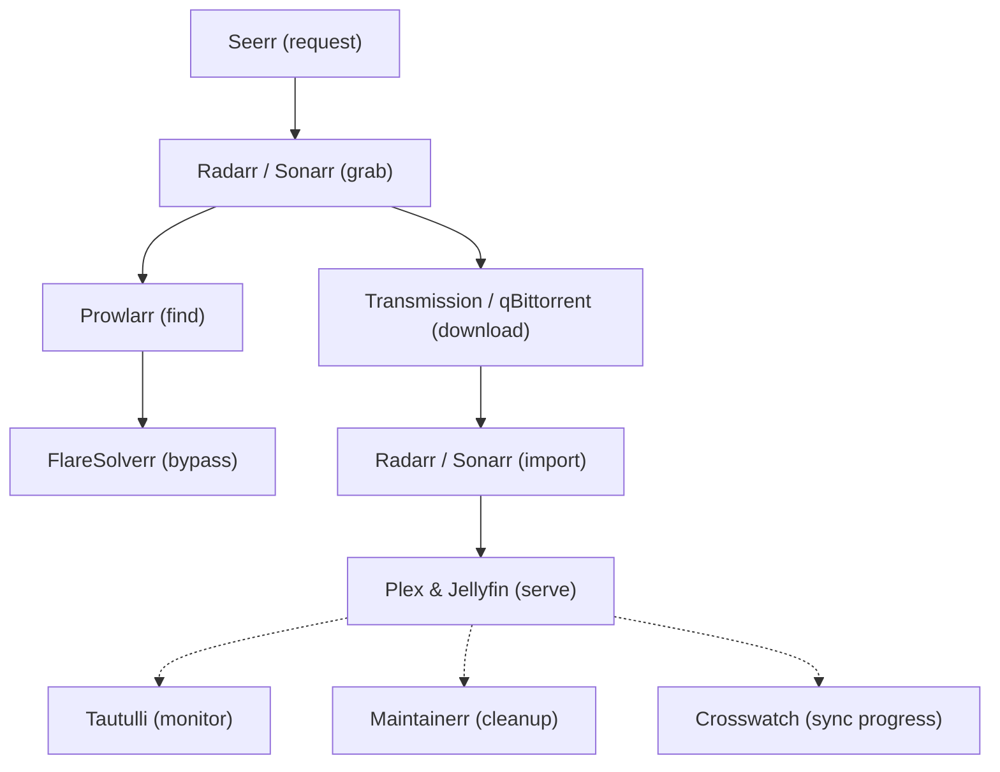

# 🎬 Media Stack

The media stack provides automated media management, downloading, streaming, and content discovery capabilities across two media servers.

## 📦 Components

| Component | File | Description |
|-----------|------|-------------|
| **Plex** | [`player.yml`](player.yml) | Premium media server with hardware transcoding (Intel GPU via `/dev/dri`) |
| **Jellyfin** | [`player.yml`](player.yml) | Open-source media server, GPU-accelerated transcoding |
| **Radarr** | [`radarr.yml`](radarr.yml) | Automated movie collection manager |
| **Sonarr** | [`sonarr.yml`](sonarr.yml) | Automated TV show collection manager |
| **Bazarr** | [`bazarr.yml`](bazarr.yml) | Subtitle downloader for movies & shows |
| **Prowlarr** | [`prowlarr.yml`](prowlarr.yml) | Indexer aggregator for Radarr/Sonarr |
| **Transmission** | [`download.yml`](download.yml) | Torrent client with Flood UI (Keel auto-updated) |
| **qBittorrent** | [`qbittorrent.yml`](qbittorrent.yml) | Feature-rich torrent client |
| **Seerr** | [`seerr.yml`](seerr.yml) | Media request & discovery portal |
| **Tautulli** | [`tautulli.yml`](tautulli.yml) | Plex usage monitoring and analytics |
| **Maintainerr** | [`maintainerr.yml`](maintainerr.yml) | Rule-based media library cleanup & management |
| **Crosswatch** | [`crosswatch.yml`](crosswatch.yml) | Cross-platform media watch progress synchronization |
| **FlareSolverr** | [`flaresolverr.yml`](flaresolverr.yml) | Proxy server to bypass Cloudflare protection for indexers |

## 🔄 Automation Workflow

## 🗄️ Storage

All PersistentVolumes and PersistentVolumeClaims are defined in [`storage.yml`](storage.yml). Storage is backed by **CephFS** at `/mnt/cephfs/docker/media/`.

Media files are served from:
- **Movies**: `/mnt/cephfs/data/Videos/Movies`
- **TV Shows**: `/mnt/cephfs/data/Videos/TV`
- **Downloads**: `/mnt/cephfs/data/downloads`

## 🌐 Service URLs

| Service | URL |
|---------|-----|
| Plex | `https://plex.ygnv.my.id` |
| Jellyfin | `https://jellyfin.ygnv.my.id` |
| Transmission | `https://transmission.ygnv.my.id` |
| Seerr | `https://seerr.ygnv.my.id` |
| Tautulli | `https://tautulli.ygnv.my.id` |
| Maintainerr | `https://maintainerr.ygnv.my.id` |
| Crosswatch | `https://crosswatch.ygnv.my.id` |
| Radarr | `https://radarr.ygnv.my.id` |

> **Note**: Plex and Jellyfin are pinned to `kube-2` (GPU-equipped node) via `nodeSelector: kubernetes.io/hostname: kube-2`.
