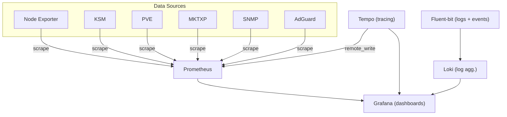

# 📊 Monitoring & Observability

The observability stack provides full-spectrum metrics, logging, distributed tracing, and uptime monitoring for the entire cluster.

## 🏗️ Architecture Overview



## 📦 Core Stack Components

| Component | File | Description |
|-----------|------|-------------|
| **Prometheus** | [`prometheus/prometheus-deploy.yml`](prometheus/prometheus-deploy.yml) | Metrics collection & alerting engine |
| **Grafana** | [`grafana/grafana.yml`](grafana/grafana.yml) | Dashboard visualization with image-renderer sidecar |
| **Loki** | [`loki-deploy.yml`](loki-deploy.yml) | Horizontally-scalable log aggregation (TSDB v13 schema) |
| **Tempo** | [`tempo.yml`](tempo.yml) | Distributed tracing backend (OTLP, Jaeger, Zipkin) |
| **Fluent-bit (logs)** | [`fluent-bit.yml`](fluent-bit.yml) | DaemonSet: forwards container logs to Loki |
| **Fluent-bit (events)** | [`fluent-bit.yml`](fluent-bit.yml) | Deployment: forwards Kubernetes events to Loki |
| **Uptime Kuma** | [`uptime/uptime-kuma.yml`](uptime/uptime-kuma.yml) | Self-hosted uptime & service monitoring (MariaDB backend) |

## 📡 Exporters

Metrics are collected from various sources using dedicated exporters:

| Exporter | File | Port | Description |
|----------|------|------|-------------|
| **Node Exporter** | [`node-exporter.yml`](node-exporter.yml) | `9100` | Hardware & OS metrics (DaemonSet, host network) |
| **Kube State Metrics** | [`kube-state-metrics.yml`](kube-state-metrics.yml) | `8080` | Cluster-level resource state metrics |
| **PVE Exporter** | [`pve-exporter.yml`](pve-exporter.yml) | `9221` | Proxmox VE host/guest metrics |
| **MKTXP** | [`mktxp.yml`](mktxp.yml) | `49090` | MikroTik router metrics (E50UG, SXT5HPnD) |
| **SNMP Exporter** | [`snmp-exporter.yml`](snmp-exporter.yml) | — | Network device metrics via SNMP |
| **AdGuard Exporter** | [`adguard-exporter.yml`](adguard-exporter.yml) | `9618` | AdGuard DNS server metrics |

## ⚙️ Key Configuration Details

### Tempo — Distributed Tracing
- **Image**: `grafana/tempo:3.0.0`
- **Ingest protocols**: OTLP gRPC (`:4317`), OTLP HTTP (`:4318`), Jaeger Thrift HTTP (`:14268`), Jaeger gRPC (`:14250`), Zipkin (`:9411`)
- **Storage**: Local filesystem at `/mnt/cephfs/docker/monitoring/tempo`
- **Metrics Generator**: Pushes `service-graphs` and `span-metrics` processors to Prometheus via remote_write

### Loki — Log Aggregation
- **Image**: `grafana/loki:3.7.2`
- **Schema**: TSDB v13 (from `2025-05-18`)
- **Retention**: 7 days (168h) with compaction enabled
- **Ingestion limits**: 20MB/s rate, 512KB max line size, 10,000 max streams

### Fluent-bit — Log Forwarding (Dual Setup)
- **`fluent-logs`** (DaemonSet): Tails `/var/log/containers/*.log` on every node, enriches with Kubernetes metadata, ships to Loki
- **`fluent-events`** (Deployment): Consumes Kubernetes API events via `kubernetes_events` input, ships to Loki

### Grafana — Visualization
- **Image**: `grafana/grafana:13.0.2`
- **Sidecar**: `grafana-image-renderer:v5.8.8` on port `8081` for panel screenshots
- **Auth**: Authentik OAuth2 SSO (`auth.ygnv.my.id`)
- **Alerts**: 8 provisioned alert groups (CPU, RAM, Reboot, Storage, Ceph, Kubernetes, Infra, Link)
- **Ingress**: `grafana.ygnv.my.id`

### Prometheus — Metrics
- **Config**: [`prometheus/prometheus-config.yml`](prometheus/prometheus-config.yml)
- **Remote-write target**: Receives span-metrics and service-graph metrics from Tempo

## 🔗 Service URLs

| Service | URL |
|---------|-----|
| Grafana | `https://grafana.ygnv.my.id` |
| Loki | `https://loki.ygnv.my.id` |
| Uptime Kuma | `https://uptime.ygnv.my.id` |

## 🔧 Troubleshooting

### Grafana Provisioned Alerts Stuck

See [`grafana/readme.md`](grafana/readme.md) for instructions on manually removing orphaned provisioned alerts from the SQLite database.

### Checking Logs Pipeline

```bash
# Check fluent-bit logs DaemonSet
kubectl get daemonset fluent-logs -n monitoring

# Check fluent-bit events Deployment
kubectl get deployment fluent-events -n monitoring

# View Loki ingestion stats
kubectl logs -n monitoring -l app=loki --tail=50
```

### Checking Traces

```bash
# View Tempo status
kubectl logs -n monitoring -l app=tempo --tail=50

# Check Tempo service endpoints
kubectl get svc tempo -n monitoring
```
