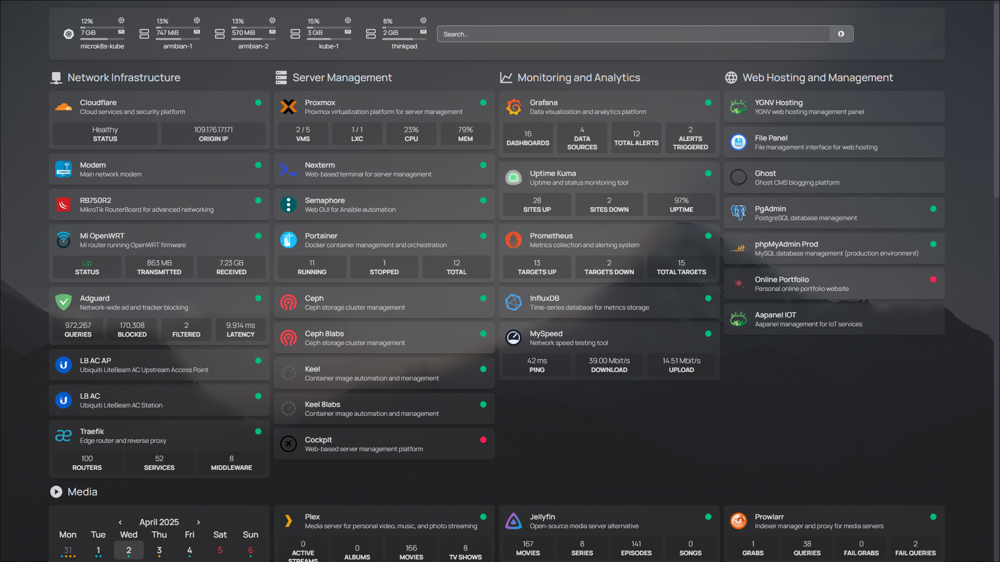
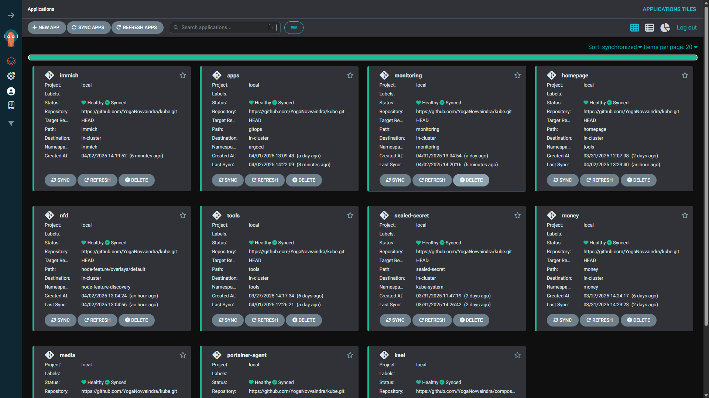
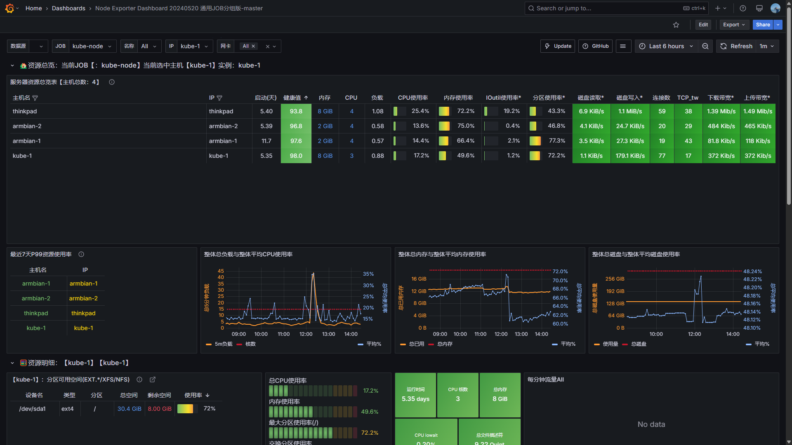
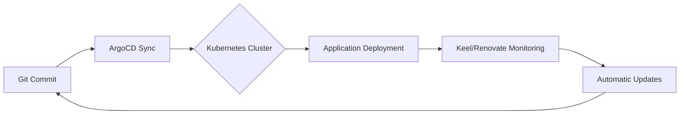

# 🏡 HomeLab Kubernetes Cluster

Welcome to my HomeLab Kubernetes Cluster! This repository contains the configuration and deployment files for managing various services and applications in my homelab environment. The cluster is designed to provide a self-hosted, automated, and scalable infrastructure for personal and experimental use.

## 📸 Screenshots

### 🏠 Homepage

### 🚀 ArgoCD

### 📊 Grafana

## 🌟 Overview

The Kubernetes cluster follows **declarative infrastructure management** principles, where all configurations are version-controlled and automatically synchronized with the cluster state. Key organizational components include:

- **📁 Namespace Segregation**: Services are grouped by purpose, often residing in dedicated namespaces named after the application or service group (e.g., `harbor`, `monitoring`).
- **⚙ GitOps Workflow**: ArgoCD-driven continuous deployment from Git repository
- **🔐 Security First**: Sealed Secrets for encrypted credential management
- **🤖 Automated Updates**: Keel for container images and Renovate for dependency versions

## 🚀 Features

- **📜 Declarative Configuration**: Entire infrastructure defined as code in version-controlled manifests
- **🔄 GitOps Automation**: ArgoCD synchronization with self-healing capabilities
- **🆕 Continuous Updates**: 
  - `Keel`: Automatic rolling updates for latest container images
  - `Renovate`: Semantic versioning maintenance for container images
- **📊 Observability Stack**: Prometheus/Grafana monitoring with alert integration
- **🗄 Persistent Storage**: CephFS provisioner with automated volume management
- **🔒 Zero-Trust Security**: Authentik SSO integration and network policies
- **📡 Load Balancing**: MetalLB for bare-metal load balancing

## 📂 Repository Structure

This Git repository is organized to support a GitOps workflow with ArgoCD:

- **`gitops/`**: This directory contains ArgoCD `Application` custom resources. Each file typically defines an application or a group of related applications to be deployed and managed by ArgoCD. These definitions point to the actual Kubernetes manifests, Helm charts, or Kustomizations for each application.
- **`apps.yml`**: This file, located in the root, is an ArgoCD `Application` definition that implements the app-of-apps pattern. It tells ArgoCD to monitor the `gitops/` directory, effectively deploying all applications defined within that path.
- **Application Manifest Directories (e.g., `harbor/`, `monitoring/`, `tools/`, `services/`, etc.)**: Each of these top-level directories typically holds the raw Kubernetes YAML manifests, Kustomize configurations, or Helm chart value files for a specific application or a logical group of services. The ArgoCD `Application` definitions in `gitops/` will point to these directories as their source.
- **`cert-manager/`, `metallb/`, `node-feature/`, `sealed-secret/`, `traefik/`, `trivy/`**: These directories contain resources for cluster add-ons or system-level services, often managed as separate ArgoCD applications.

## 📦 Applications

This cluster hosts a variety of self-managed applications and services.

### 🚀 Core Infrastructure & GitOps
- **🔄 ArgoCD**: GitOps deployment controller.
- **🐋 Keel**: Automated image updates for latest tags.
- **🕵️ Portainer Agent**: Connects to a Portainer instance for cluster management.
- **🔏 Sealed Secrets**: Manages encrypted secrets in Git.
- **🚦 Traefik**: TLS-terminating ingress controller (mentioned in Infrastructure).
- **⚖️ MetalLB**: Load balancer for bare-metal environments (mentioned in Infrastructure).

### 🛠️ General Tools & Utilities
- **🔑 Authentik**: Centralized authentication and identity provider (mentioned in Infrastructure).
- **👀 Changedetection.io**: Monitors websites for changes.
- **🎨 Excalidraw**: Virtual collaborative whiteboard.
- **📂 FileBrowser**: Web-based file management.
- **💻 Gitea**: Self-hosted Git service.
- **🔧 IT-Tools**: A collection of handy online tools for developers.
- **📚 Outline**: Collaborative knowledge base/wiki.
- **🐘 pgAdmin**: PostgreSQL administration and development platform.
- **🐬 phpMyAdmin**: Web-based administration tool for MySQL and MariaDB.
- **♻️ Reloader**: Automatically restarts pods when ConfigMaps or Secrets are updated.
- **🖼️ Reubah**: Web based image editor.
- **⚙️ Semaphore**: UI for running Ansible playbooks.
- **💨 Speedtest**: Tool for checking internet connection speed.
- **📄 Stirling-PDF**: Web-based PDF manipulation tool.
- **🔗 Syncthing**: Continuous file synchronization across devices.
- **🛡️ Vaultwarden**: Self-hosted password manager (Bitwarden compatible; mentioned in Security).

### 📊 Observability & Monitoring
- **📜 Fluent-bit**: Lightweight log processor and forwarder.
- **📊 Grafana**: Dashboards for visualizing metrics and logs.
- **☸️ Kube State Metrics**: Exposes cluster-level metrics.
- **✍️ Loki**: Horizontally-scalable, multi-tenant log aggregation system.
- **📡 MKTXP**: Exporter for MikroTik router metrics.
- **💻 Node Exporter**: Exporter for hardware and OS metrics exposed by *NIX kernels.
- **📈 Prometheus**: Metrics collection and alerting toolkit.
- **🖥️ virtualization PVE Exporter**: Exporter for Proxmox VE host and guest metrics.
- **📡 SNMP Exporter**: Exporter for metrics from SNMP-enabled devices.
- **💓 Uptime Kuma**: Self-hosted uptime monitoring tool.

### 📦 Application Services
- **🐳 Harbor**: Cloud native container registry.
- **🖼️ Immich**: Self-hosted backup solution for photos and videos.
- **💰 Money**: Personal money generator.
- **☁️ Cloudflared**: Creates secure tunnels to Cloudflare's edge.
- **🌿 Ecoguardian**: Service for (purpose assumed; description pending or remove).
- **✍️ Ghost**: Professional publishing platform / blogging.
- **🖼️ Portfolio**: Application to showcase projects/work.
- **📋 Project**: All my personal projects.

### 🎬 Media
- **🎬 Plex Media Server**: 4K transcoding capable
- **📺 Arr Suite**: Radarr/Sonarr/Bazarr stack
- **📥 Transmission & Aria2**: VPN-wrapped torrent clients
- **📊 Tautulli**: Plex usage monitoring
- **📂 Overseerr**: Media request management

## 🛠 Infrastructure

- **☸ Kubernetes**: MicroK8s cluster with embedded Ceph storage
- **🚦 Traefik**: TLS-terminating ingress controller
- **📡 MetalLB**: Load balancer for bare-metal environments
- **🏷️ Node Feature Discovery (NFD)**: Detects hardware features and labels nodes, enabling advanced workload scheduling.
- **🔐 Authentik**: Centralized authentication gateway
- **🗂 CephFS**: Distributed storage with replication
- **📦 Helm**: Package manager for chart deployments

## 📜 Deployment Workflow

## 🔒 Security Implementation

- **🔏 Sealed Secrets**: Encrypted secrets using cluster-specific certificates
- **🛡️ Trivy**: Vulnerability scanning for container images and other artifacts
- **🔐 RBAC Enforcement**: Namespace-bound service accounts
- **🛡 Network Policies**: Zero-trust pod communication rules
- **🔒 Vaultwarden**: Self-hosted Bitwarden-compatible secrets manager

## 🤝 Contributing & Adaptation
While primarily personal infrastructure, this setup demonstrates:
- Enterprise-grade patterns for homelab use
- Scalable GitOps implementation
- Security-conscious home infrastructure
Feel free to fork and adapt components to your environment!

## 📜 License
This project is licensed under the MIT License.