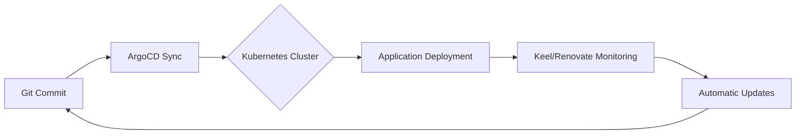

# 🏡 HomeLab Kubernetes Cluster

Welcome to my HomeLab Kubernetes Cluster! This repository contains the configuration and deployment files for managing various services and applications in my homelab environment. The cluster is designed to provide a self-hosted, automated, and scalable infrastructure for personal and experimental use.

## 📸 Screenshots

### 🏠 Homepage

### 🚀 ArgoCD

### 📊 Grafana

## 🌟 Overview

The Kubernetes cluster follows **declarative infrastructure management** principles, where all configurations are version-controlled and automatically synchronized with the cluster state. Key organizational components include:

- **📁 Namespace Segregation**: Services grouped by purpose in dedicated namespaces
- **⚙ GitOps Workflow**: ArgoCD-driven continuous deployment from Git repository
- **🔐 Security First**: Sealed Secrets for encrypted credential management
- **🤖 Automated Updates**: Keel for container images and Renovate for dependency versions

## 🚀 Features

- **📜 Declarative Configuration**: Entire infrastructure defined as code in version-controlled manifests
- **🔄 GitOps Automation**: ArgoCD synchronization with self-healing capabilities
- **🆕 Continuous Updates**: 
  - `Keel`: Automatic rolling updates for latest container images
  - `Renovate`: Semantic versioning maintenance for container images
- **📊 Observability Stack**: Prometheus/Grafana monitoring with alert integration
- **🗄 Persistent Storage**: CephFS provisioner with automated volume management
- **🔒 Zero-Trust Security**: Authentik SSO integration and network policies

## 📦 Applications

### 🛠 Tools Namespace
- **📂 FileBrowser**: Web-based file management
- **🔗 Syncthing**: Cross-device file synchronization
- **📝 Knowledge Suite**: Outline + Excalidraw combo
- **🤖 Automation Tools**: Semaphore (Ansible) + Changedetection.io

### 📊 Monitoring Stack
- **📈 Prometheus**: Metrics collection with Thanos sidecar
- **📊 Grafana**: Dashboards with Loki/Prometheus sources
- **📡 Exporters**: Node + MikroTik metrics collection
- **🚨 Alert Manager**: Integrated with Pushover notifications

### 🤖 Automation Ecosystem
- **🔄 ArgoCD**: GitOps deployment controller
- **🐋 Keel**: Automated image updates (latest tags)
- **🆙 Renovate**: Dependency version management (SemVer)
- **🤖 Semaphore**: Ansible playbook orchestration

### 🎥 Media Center
- **🎬 Plex Media Server**: 4K transcoding capable
- **📺 Arr Suite**: Radarr/Sonarr/Bazarr stack
- **📥 Transmission**: VPN-wrapped torrent client

## 🛠 Infrastructure

- **☸ Kubernetes**: K3s cluster with embedded Ceph storage
- **🚦 Traefik**: TLS-terminating ingress controller
- **🔐 Authentik**: Centralized authentication gateway
- **🗂 CephFS**: Distributed storage with replication
- **📦 Helm**: Package manager for chart deployments

## 📜 Deployment Workflow

## 🔒 Security Implementation

- **🔏 Sealed Secrets**: Encrypted secrets using cluster-specific certificates
- **🔐 RBAC Enforcement**: Namespace-bound service accounts
- **🛡 Network Policies**: Zero-trust pod communication rules
- **🔒 Vaultwarden**: Self-hosted Bitwarden-compatible secrets manager

## 🤝 Contributing & Adaptation
While primarily personal infrastructure, this setup demonstrates:
- Enterprise-grade patterns for homelab use
- Scalable GitOps implementation
- Security-conscious home infrastructure
Feel free to fork and adapt components to your environment!

## 📜 License
This project is licensed under the MIT License.